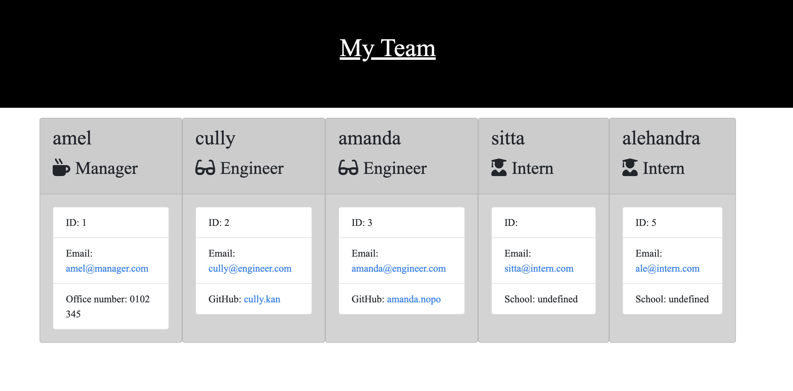

# Team Profile Generator

## Description

This application will take in information about employees on a software engineering team, then generates an HTML webpage that displays summaries for each person. This project demonstrates use of OOP and TDD using Jest. 

## Tables of Contents

* Installation
* Usage
* License
* Contributing
* Tests
* Question

## Installation

User should clone the repository of the project from gitHub into th VS code and download Node js. This application uses Jest also requires inquirer module.

## Usage

https://drive.google.com/file/d/1z6LH5DyXLuwDZGR8TO7r_GrAuOlLuCtg/view

The output of the generated HTML’s appearance and functionality project:

## License

## Constributing

Provide to the installation section.

## Tests
Run npm test to run Jest

## Questions

If you have any questions about thiis project, please contact me directly : 
Email : noeamelyaofficial@hotmail.com
GitHub : https://github.com/noeamelya/

 

© 2023 N Amelya